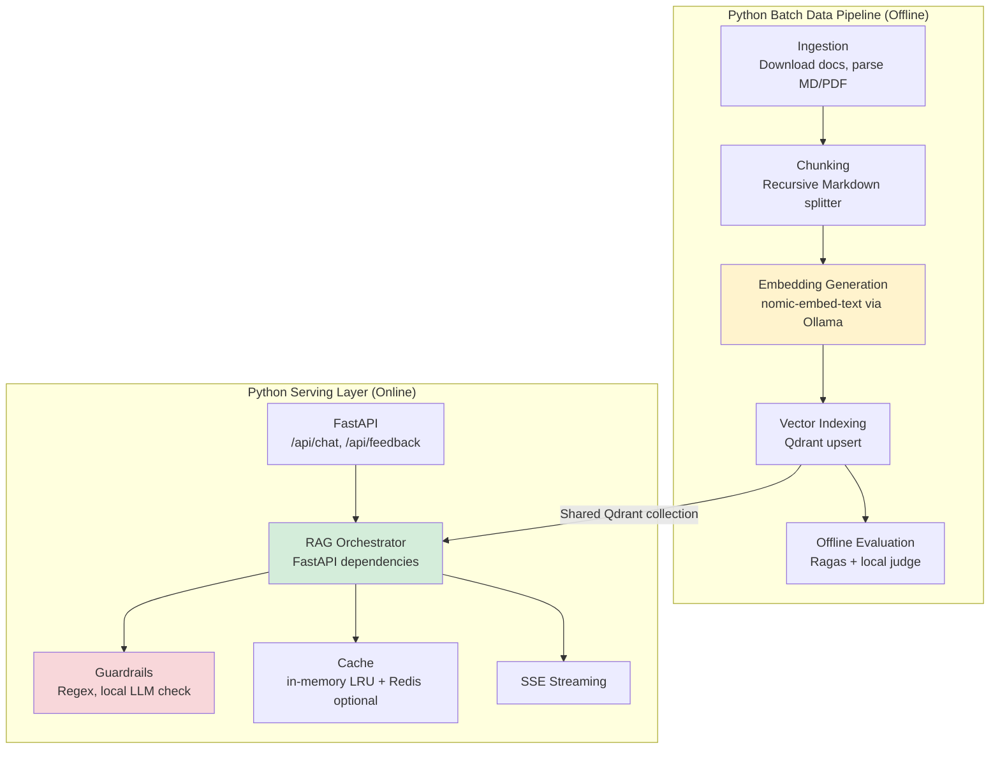
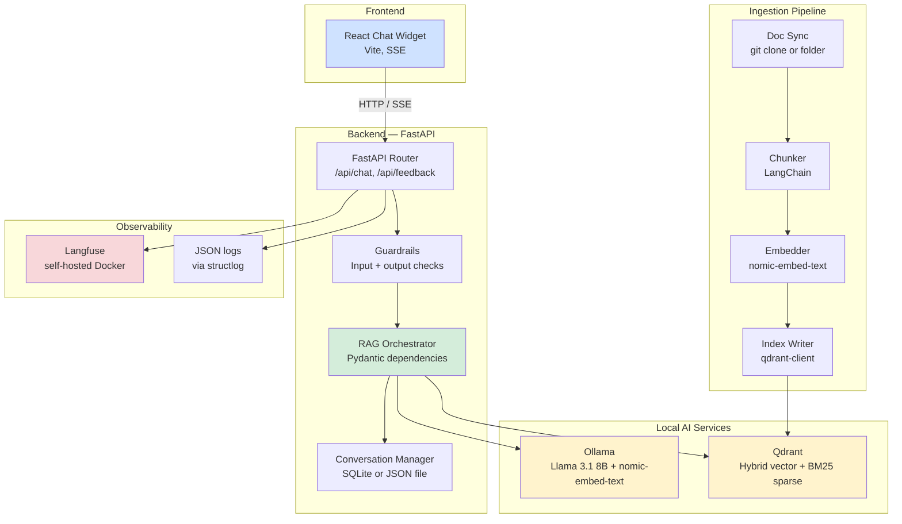
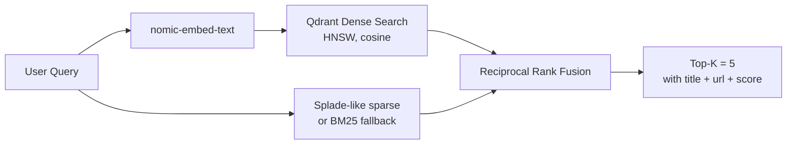
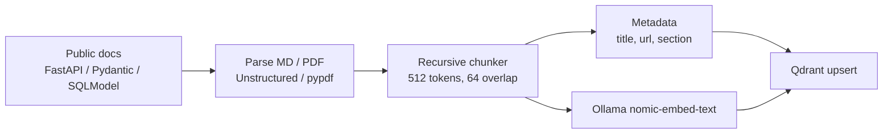
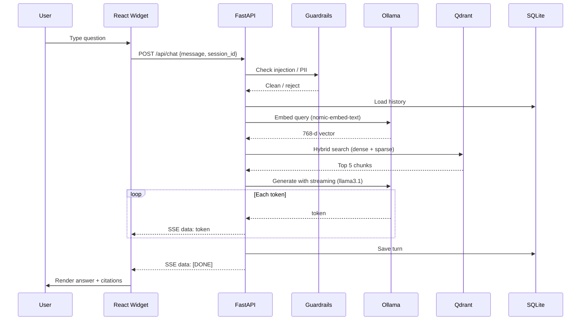
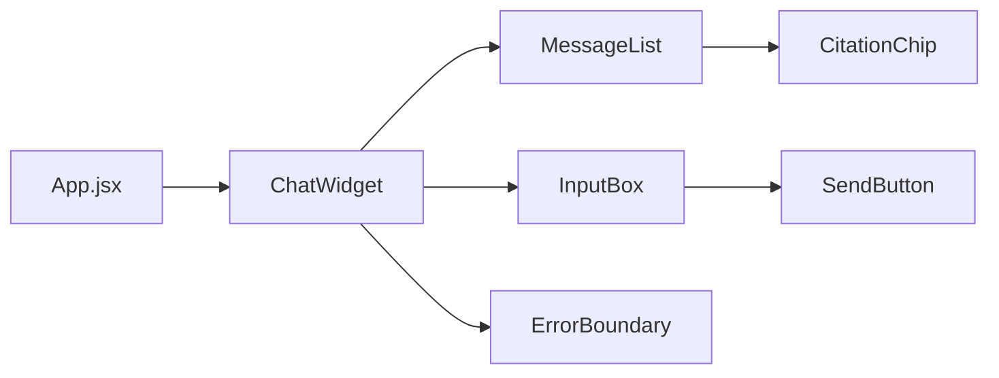
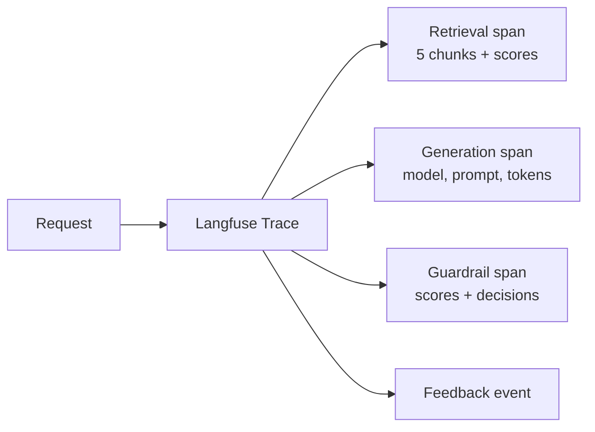

# AI-Powered Chat Assistant — RAG Knowledge Assistant (2026 Practice Edition)

> **Stack:** Python (FastAPI) + React + Ollama + Qdrant + Docker/Colima
> **Single-Language Stack:** Python for both the data pipeline and the serving layer
> **Cost Target:** $0 for the local development and "production" path
> **Hardware Target:** MacBook Pro M1 32 GB RAM, macOS Sequoia
> **Deployment:** Local Docker Compose (Colima) for the full end-to-end flow
> **Corpus:** Open-source documentation subset (FastAPI + Pydantic v2 + SQLModel)
> **LLM Frameworks:** LangChain for the offline ingestion pipeline, direct SDK clients for the serving layer
> **Observability & Eval:** Langfuse (self-hosted, Docker) + Ragas (offline, local judge)
> **Purpose:** Personal interview-prep project that reproduces the full ideation → development → "production" → monitoring lifecycle of a RAG chat assistant

---

## Project Constraints & Design Decisions

These constraints are the only reason the architecture looks the way it does. Every decision is a cost-conscious, solo-developer trade-off.

### Constraint 1 — Learning and interview practice (2026)

| Aspect        | Constraint                                                       | Impact on Architecture                                                                                                                                            |
| ------------- | ---------------------------------------------------------------- | ----------------------------------------------------------------------------------------------------------------------------------------------------------------- |
| **Goal**      | Build confidence explaining the full RAG lifecycle in interviews | The project must cover ingestion, chunking, embedding, retrieval, generation, streaming, guardrails, evaluation, monitoring, and deployment — not just a notebook |
| **Scope**     | One evening to bootstrap, one weekend to harden                  | Stack is opinionated and pre-integrated; no time for multi-cloud comparison or custom frameworks                                                                  |
| **Narrative** | Must be able to justify every decision with trade-offs           | Every tool was chosen for a clear reason and can be swapped if the corpus or scale changes                                                                        |

### Constraint 2 — Cost as close to $0 as possible

| Aspect                 | Constraint                                              | Impact on Architecture                                                                                                     |
| ---------------------- | ------------------------------------------------------- | -------------------------------------------------------------------------------------------------------------------------- |
| **LLM cost**           | No OpenAI / Anthropic / Azure monthly bill for practice | Local Ollama for embedding and generation; optional free cloud API (Groq) only for stronger eval judge                     |
| **Vector store cost**  | No managed vector DB subscription                       | Qdrant self-hosted in Docker; local volume for persistence                                                                 |
| **Observability cost** | No SaaS tracing bill                                    | Langfuse self-hosted in Docker; logs in local volumes                                                                      |
| **Hosting cost**       | No cloud VM subscription for the main path              | FastAPI backend, React frontend, Qdrant, Ollama, and Langfuse all run inside a single local docker-compose stack on Colima |

### Constraint 3 — Local-first on Apple Silicon

| Aspect              | Constraint                                                                | Impact on Architecture                                                                                        |
| ------------------- | ------------------------------------------------------------------------- | ------------------------------------------------------------------------------------------------------------- |
| **Docker runtime**  | Colima on macOS                                                           | All containers are multi-arch aware or build `linux/arm64` images; Colima VM has 8 GB CPU RAM and 100 GB disk |
| **LLM size**        | Must fit in ~24 GB of available RAM alongside vector store and containers | 8B-parameter models in 4-bit quantization (Llama 3.1 8B ~ 5 GB, Qwen2.5 7B ~ 4.5 GB)                          |
| **Embedding model** | Same local runtime                                                        | `nomic-embed-text` (small, 768-d, ~ 0.5 GB) or `all-minilm` (384-d, ~ 0.1 GB)                                 |
| **Container spec**  | Minimal per-project rules (1 CPU, 1 GB RAM, 5 GB disk)                    | Each Colima container is capped at these limits; shared nothing, state in named volumes                       |

### Constraint 4 — Existing skills and future employability

| Aspect                | Constraint                                    | Impact on Architecture                                                                        |
| --------------------- | --------------------------------------------- | --------------------------------------------------------------------------------------------- |
| **Backend language**  | Strongest in Python                           | FastAPI for serving; LangChain for ingestion; no Node.js split (one person, one venv)         |
| **Frontend language** | React for interviews and practice             | React 18 + Vite, SSE streaming, standard hooks, Error Boundary                                |
| **Frameworks**        | Prefer tools used in real job postings (2026) | FastAPI, Ollama, Qdrant, Langfuse, Ragas, Docker, React — all appear in 2026 AI/LLM job specs |

### How Constraints Map to Key Architecture Decisions

```mermaid
graph LR
    subgraph "Constraints"
        C1[Interview practice<br/>full lifecycle]
        C2[Zero cost<br/>local-first]
        C3[Apple Silicon<br/>M1 32GB]
        C4[Python + React<br/>skills]
    end

    subgraph "Key Decisions"
        D1[Python-only stack<br/>FastAPI + LangChain]
        D2[Ollama local LLM<br/>+ local embeddings]
        D3[Qdrant self-hosted<br/>in Docker]
        D4[Langfuse self-hosted<br/>in Docker]
        D5[Single docker-compose<br/>local "production"]
        D6[React + Vite + SSE]
        D7[Ragas offline eval<br/>with local judge]
    end

    C1 --> D1
    C1 --> D4
    C1 --> D7
    C2 --> D2
    C2 --> D3
    C2 --> D4
    C2 --> D5
    C3 --> D2
    C3 --> D3
    C4 --> D1
    C4 --> D6

    style C2 fill:#fff3cd
    style C3 fill:#cfe2ff
    style D2 fill:#d4edda
```

| Decision                               | Driven By  | Rationale                                                                                                                                                                                                          |
| -------------------------------------- | ---------- | ------------------------------------------------------------------------------------------------------------------------------------------------------------------------------------------------------------------ |
| **Python-only stack (FastAPI)**        | C1, C2, C4 | One language = one venv, one test suite, one person can finish it in a weekend. FastAPI is the most common Python serving framework for AI apps in 2026 and is excellent for SSE streaming.                        |
| **Ollama for LLM + embeddings**        | C2, C3     | Running an 8B model locally is free and fast enough on M1. `nomic-embed-text` gives good 768-d embeddings. No API keys, rate limits, or usage anxiety.                                                             |
| **Qdrant self-hosted in Docker**       | C2, C3     | Native hybrid (dense + sparse) and HNSW, open-source, runs in a tiny container, persists to a local volume.                                                                                                        |
| **Langfuse self-hosted in Docker**     | C1, C2     | Production-grade LLM observability for free. Traces, scores, datasets, and prompt management — all in a local container.                                                                                           |
| **Single docker-compose "production"** | C2, C3     | The full stack fits in one `docker-compose.yml`. "Production" for this project means a reproducible local deployment that mimics real concerns: health checks, env vars, logs, container limits, restart policies. |
| **React + Vite + SSE**                 | C4         | React is the expected frontend in most interviews. Vite is fast to start. SSE is simpler than WebSockets and naturally pairs with FastAPI streaming.                                                               |
| **Ragas offline eval**                 | C1, C2     | Builds the evaluation muscle for interviews. The judge is a local Ollama model or the Groq free tier, so the eval costs nothing.                                                                                   |

---

## Table of Contents

1. [Project Constraints & Design Decisions](#project-constraints--design-decisions)
2. [Executive Summary](#executive-summary)
3. [Single-Language Python Stack](#single-language-python-stack)
4. [Local Development Environment](#local-development-environment)
5. [Problem Statement](#problem-statement)
6. [High-Level Architecture](#high-level-architecture)
7. [Component Deep-Dive](#component-deep-dive)
8. [Data Ingestion Pipeline](#data-ingestion-pipeline)
9. [Query Pipeline (RAG Flow)](#query-pipeline-rag-flow)
10. [API Design](#api-design)
11. [React Chat Widget](#react-chat-widget)
12. [Security & Responsible AI](#security--responsible-ai)
13. [Scalability & Performance](#scalability--performance)
14. [Monitoring & Observability](#monitoring--observability)
15. [Testing Strategy](#testing-strategy)
16. [Cost Estimation](#cost-estimation)
17. [Implementation Phases](#implementation-phases)
18. [Failure Modes & Resilience](#failure-modes--resilience)
19. [Enterprise Gap Register](#enterprise-gap-register)
20. [Interview Discussion Points](#interview-discussion-points)
21. [2026 Technology Readiness](#2026-technology-readiness)
22. [Technology Stack Summary](#technology-stack-summary)

---

## Executive Summary

A RAG-based AI Chat Assistant that answers natural-language questions over a small open-source documentation corpus:

- _"What is the difference between Pydantic `BaseModel` and `BaseSettings`?"_
- _"How do I declare path parameters in FastAPI?"_
- _"What is the difference between SQLModel and SQLAlchemy?"_

The system uses a **single Python stack**: a **LangChain-powered offline ingestion pipeline** converts public docs into chunks, embeds them with **Ollama `nomic-embed-text`**, and stores them in a **self-hosted Qdrant** vector DB. A **FastAPI backend** orchestrates the RAG flow: query rewriting, hybrid retrieval, context assembly, and streaming generation with **Ollama `Llama 3.1 8B`**. A **React + Vite chat widget** provides the conversational UI with Server-Sent Events.

The entire system runs inside **Docker Compose on Colima** on a MacBook Pro M1, costing **$0** for the core workload.

---

## Single-Language Python Stack

The 2024 architecture split Python (data pipeline) and Node.js (serving). For a solo 2026 practice project, a single Python stack is the right simplification.



### Why a Single Python Stack

| Layer                          | Rationale                                                                                                                                                    |
| ------------------------------ | ------------------------------------------------------------------------------------------------------------------------------------------------------------ |
| **Data pipeline**              | Python remains the best ML/NLP tooling: LangChain/Unstructured for loaders, BeautifulSoup/MarkdownIt for HTML/MD, pypdf for PDF, Ragas for eval.             |
| **Serving layer**              | FastAPI gives type hints, automatic OpenAPI docs, dependency injection, native `StreamingResponse`, and Python 3.12 async/await — all on one stack.          |
| **No cross-language coupling** | Both layers share Pydantic models for `DocumentChunk`, `ChatRequest`, `ChatResponse`. The Qdrant collection schema and JSON responses are the only contract. |

### Why Not Node.js for the Serving Layer

- The 2024 project used Node.js because the customer already had Node.js expertise and Container Apps infra.
- For a one-person practice project, adding Node.js means a second runtime, a second package manager, a second test setup, and more mental overhead.
- Interview preparation benefits more from depth in one stack than from a complex but realistic multi-language split.
- If you later interview for a company that uses Node.js, you can explain: "I know the trade-off — the 2024 production build used Node.js for the serving layer to match team skills and infrastructure; for my solo practice I collapsed to Python for speed, and I can reproduce the same RAG flow in any runtime."

---

## Local Development Environment

All runtime services run in Docker/Colima, but local dev work (running the
ingestion script, the eval notebook, ad-hoc debugging, and running tests)
uses a **conda** virtual environment on the host. This keeps the host Python
clean and matches the project rule of preferring virtual environments over
global installs.

### Conda Environment Setup

```bash
# Create and activate a dedicated conda env (Python 3.12)
conda create -n rag-chat python=3.12 -y
conda activate rag-chat

# Install all Python dependencies with pip3
pip3 install -r requirements.txt
```

### Sample `requirements.txt`

```text
# --- Serving layer ---
fastapi>=0.110
uvicorn[standard]>=0.30
pydantic>=2.10
sse-starlette>=2.1

# --- RAG / orchestration ---
langchain>=0.3
langchain-ollama>=0.2
langchain-qdrant>=0.1
qdrant-client>=1.11
ollama>=0.3

# --- Ingestion ---
unstructured>=0.15
pypdf>=4.0
beautifulsoup4>=4.12

# --- Observability ---
langfuse>=3.0
structlog>=24.1

# --- Evaluation ---
ragas>=0.2
datasets>=2.20

# --- Dev / test ---
pytest>=8.0
pytest-asyncio>=0.23
httpx>=0.27
```

> **Rule:** Always use `pip3 install` inside the conda env. Never install
> packages into the system Python.

---

## Problem Statement

| Challenge                 | Current State                                                                                                     | Target State                                                                              |
| ------------------------- | ----------------------------------------------------------------------------------------------------------------- | ----------------------------------------------------------------------------------------- |
| **Information discovery** | Docs are scattered across FastAPI, Pydantic, and SQLModel sites; search is keyword-only or requires tab-switching | Ask a single question, get a grounded answer with a source link                           |
| **Context freshness**     | No single index over all three docs                                                                               | Re-ingest the corpus in minutes from a Git URL or local folder                            |
| **Answer quality**        | Search returns pages, not answers                                                                                 | Retrieve the most relevant chunk and generate a cited, concise answer                     |
| **Learning feedback**     | No way to verify the assistant is correct                                                                         | Offline evaluation with a golden dataset; human-in-the-loop feedback UI                   |
| **Cost barrier**          | Managed AI platforms charge per token and per host                                                                | Local-first, $0 core workload; the same architecture can be ported to a cheap cloud later |

---

## High-Level Architecture



---

## Component Deep-Dive

### 1. Qdrant — Vector Store and Hybrid Search

Qdrant is the central retrieval engine. It runs in a Docker container, persists to a named volume, and supports dense + sparse vector search in the same collection.



**Collection Schema (simplified):**

```json
{
  "collection_name": "docs-knowledge",
  "vectors": {
    "size": 768,
    "distance": "Cosine"
  },
  "sparse_vectors": {
    "text": {
      "index": {
        "on_disk": false
      }
    }
  },
  "hnsw_config": {
    "m": 16,
    "ef_construct": 128,
    "ef": 64
  }
}
```

**Document payload:**

```json
{
  "title": "Query Parameters - FastAPI",
  "source_url": "https://fastapi.tiangolo.com/tutorial/query-params/",
  "section": "tutorial",
  "last_modified": "2026-01-15T00:00:00Z",
  "chunk_index": 3,
  "parent_doc_id": "fastapi-query-params"
}
```

**Search strategy:**

| Stage       | Method                        | Purpose                                                     |
| ----------- | ----------------------------- | ----------------------------------------------------------- |
| **Stage 1** | Dense vector search           | Capture semantic meaning of natural-language questions      |
| **Stage 2** | Sparse vector search (SPLADE) | Catch exact API names and keywords that dense search misses |
| **Stage 3** | RRF fusion                    | Merge dense and sparse rankings into a single score         |

### 2. Ollama — Local LLM and Embeddings

| Model              | Role                                                | Size on Disk | RAM at Runtime |
| ------------------ | --------------------------------------------------- | ------------ | -------------- |
| `llama3.1:8b`      | Answer generation, query rewriting, guardrail judge | ~4.7 GB      | ~6.5 GB        |
| `nomic-embed-text` | Chunk and query embeddings                          | ~0.5 GB      | ~0.8 GB        |
| `qwen2.5:7b`       | Optional cheaper/faster chat alternative            | ~4.5 GB      | ~6 GB          |
| `deepseek-r1:7b`   | Optional reasoning-heavy answer model               | ~4.5 GB      | ~6 GB          |

**Answer generation settings:**

| Config        | Value  | Rationale                                                |
| ------------- | ------ | -------------------------------------------------------- |
| `temperature` | `0.1`  | Low creativity; maximize grounding in retrieved context  |
| `num_ctx`     | `8192` | Fits 5 chunks of 512 tokens + system prompt + history    |
| `top_p`       | `0.9`  | Slight diversity without hallucination                   |
| `num_predict` | `512`  | Enough for concise answers, not too long for local model |

**System prompt:**

```text
You are a technical documentation assistant for FastAPI, Pydantic v2, and SQLModel.
Use ONLY the provided context to answer.

RULES:
1. If the context does not contain the answer, say: "I don't have enough information to answer that."
2. Cite the source title in [Source: title] format.
3. Keep answers concise — 2-4 sentences for simple questions.
4. Never fabricate API names, version numbers, or code signatures.

CONTEXT:
{context}

CONVERSATION HISTORY:
{history}
```

### 3. FastAPI Backend (Orchestration Layer)

```mermaid
graph TB
    subgraph "FastAPI Layer"
        MW[Middleware<br/>CORS, logging, rate limit]
        CHAT[POST /api/chat]
        FB[POST /api/feedback]
        HIST[GET /api/history/{session_id}]
        HEALTH[GET /api/health]
    end

    subgraph "RAG Orchestrator"
        QP[Query Rewriter]
        QE[Embedder<br/>nomic-embed-text]
        RET[Retriever<br/>Qdrant hybrid]
        RR[Result Assembler]
        GEN[Generator<br/>Ollama llama3.1]
        PP[Post-Processor<br/>Citations, confidence]
    end

    subgraph "Supporting"
        SM[Session Manager<br/>SQLite]
        CACHE[Response Cache<br/>LRU dict]
    end

    MW --> CHAT
    CHAT --> QP
    QP --> QE
    QE --> RET
    RET --> RR
    RR --> GEN
    GEN --> PP
    PP --> CHAT
    CHAT --> SM
    CHAT --> CACHE
```

**Key orchestrator pseudocode:**

```python
from fastapi import FastAPI, HTTPException
from fastapi.responses import StreamingResponse
from pydantic import BaseModel
from langfuse.decorators import observe

app = FastAPI()

class ChatRequest(BaseModel):
    message: str
    session_id: str | None = None

@app.post("/api/chat")
@observe()
async def chat(request: ChatRequest):
    # 1. Guardrail: basic injection check
    if is_prompt_injection(request.message):
        raise HTTPException(status_code=400, detail="Invalid input")

    # 2. Conversation history
    history = get_history(request.session_id)

    # 3. Query rewriting (optional)
    query = await rewrite_query(request.message, history)

    # 4. Cache check
    cached = response_cache.get(query)
    if cached:
        return StreamingResponse(iter([cached]), media_type="text/plain")

    # 5. Embed + retrieve
    embedding = await ollama_embed(query)
    documents = qdrant.search(query, embedding, top_k=5)

    # 6. Assemble context
    context = assemble_context(documents)

    # 7. Stream generation
    async def event_stream():
        answer = ""
        async for token in ollama_generate(query, context, history):
            answer += token
            yield f"data: {token}\n\n"
        final = post_process(answer, documents)
        save_message(request.session_id, request.message, final)
        response_cache.put(query, final)
        yield "data: [DONE]\n\n"

    return StreamingResponse(event_stream(), media_type="text/event-stream")
```

### 4. Conversation Manager (Multi-Turn Support)

- SQLite for session persistence (no extra container; just a mounted file).
- Stores the last 10 turns per session.
- Summarizes older history if the context window is close to full.
- Cheap and easy to inspect with `sqlite3`.

---

## Data Ingestion Pipeline

The ingestion pipeline is a standalone Python script that reads a folder of Markdown/PDF files and writes to Qdrant.



### Chunking Strategy

| Parameter      | Value                                                              | Rationale                                                                |
| -------------- | ------------------------------------------------------------------ | ------------------------------------------------------------------------ |
| Chunk size     | 512 tokens                                                         | Fits ~400 words of technical docs; 5 chunks fit in the 8K context window |
| Overlap        | 64 tokens                                                          | Preserves sentences split across chunks                                  |
| Splitter       | `RecursiveCharacterTextSplitter` with Markdown headers             | Keeps header context attached to chunks                                  |
| Pre-processing | Strip HTML, collapse whitespace, preserve code blocks in backticks | Code examples are high-value content                                     |

### Incremental vs Full Sync

- On first run: full re-index.
- On subsequent runs: hash each source file; re-index only changed files.
- Store a `manifest.json` with file hashes and last indexed timestamp.
- Qdrant payloads allow filtering by `parent_doc_id` for easy deletion of stale chunks.

---

## Query Pipeline (RAG Flow)

### End-to-End Sequence



### Query Classification & Routing

For a small local model, it is worth routing the question before the expensive retrieval + generation step:

| Class           | Handler                                      | Example                              |
| --------------- | -------------------------------------------- | ------------------------------------ |
| `documentation` | Full RAG flow                                | "How do I use dependency injection?" |
| `greeting`      | Hard-coded or tiny model reply               | "Hi"                                 |
| `off_topic`     | Polite rejection                             | "Who won the game last night?"       |
| `compare`       | Retrieve two topics then generate comparison | "Compare FastAPI and Flask"          |

A cheap local classifier (`llama3.1:8b` with a 10-token prompt) is fast enough and improves UX.

---

## API Design

### Endpoints

| Method | Path                           | Purpose                         |
| ------ | ------------------------------ | ------------------------------- |
| `POST` | `/api/v1/chat`                 | Main RAG streaming endpoint     |
| `POST` | `/api/v1/feedback`             | Thumbs up / down + comment      |
| `GET`  | `/api/v1/history/{session_id}` | Conversation history            |
| `POST` | `/api/v1/ingest`               | Trigger incremental re-index    |
| `GET`  | `/api/v1/health`               | Health check for Docker Compose |

#### `POST /api/v1/chat`

```json
// Request
{
  "message": "How do I declare optional query parameters in FastAPI?",
  "session_id": "sess_20260814_001"
}
```

```text
// Response — Server-Sent Events

data: In FastAPI, optional query parameters are declared by giving the parameter a default value.

data:  [Source: Query Parameters - FastAPI]

data: [DONE]
```

#### `POST /api/v1/feedback`

```json
// Request
{
  "session_id": "sess_20260814_001",
  "message_index": 2,
  "rating": "up",
  "comment": "Cited the exact page I needed."
}
```

---

## React Chat Widget

### Component Architecture



### State Management

- `useState` for messages and streaming state.
- `useRef` for the SSE `EventSource` so it can be cleaned up on unmount.
- `useEffect` to scroll to the latest message.
- No Redux/Zustand; keep it small.

### Build & Serve

- **Dev:** `npm run dev` (Vite dev server with HMR).
- **Production build:** `npm run build` produces a static `dist/` folder.
- **Serve the production build locally** with `npx serve -s dist` (no global
  install needed; `-s` enables SPA fallback so client-side routes work).

```bash
cd frontend
npm run build
npx serve -s dist
```

### Streaming Integration (SSE)

```javascript
const handleSend = async (text) => {
  const response = await fetch("/api/v1/chat", {
    method: "POST",
    headers: { "Content-Type": "application/json" },
    body: JSON.stringify({ message: text, session_id: sessionId }),
  });

  const reader = response.body.getReader();
  const decoder = new TextDecoder();

  while (true) {
    const { done, value } = await reader.read();
    if (done) break;
    const chunk = decoder.decode(value);
    appendToken(chunk.replace(/^data: /, ""));
  }
};
```

---

## Security & Responsible AI

For a local practice project, the full enterprise guardrail stack from 2024 is overkill. The goal is to demonstrate **defense-in-depth understanding** without cost.

| Risk                    | Practice Mitigation                                                                                                        | Production Equivalent                                |
| ----------------------- | -------------------------------------------------------------------------------------------------------------------------- | ---------------------------------------------------- |
| **Prompt injection**    | Regex + local LLM judge prompt (jailbreak detection)                                                                       | Azure AI Content Safety Prompt Shields, Lakera Guard |
| **Harmful output**      | Local judge prompt refuses hate/violence/self-harm                                                                         | Azure AI Content Safety, AWS Comprehend              |
| **PII leakage**         | Regex for emails/phone numbers; no real PII in corpus                                                                      | Azure AI Language PII Detection, Presidio            |
| **Hallucination**       | Citation check: every claim must be supported by a retrieved chunk; confidence score from answer/context cosine similarity | Groundedness model, Ragas faithfulness threshold     |
| **Off-topic questions** | Query classifier rejects non-documentation questions                                                                       | Custom classifier, keyword blocklists                |

### Confidence Score

After generation, compute a simple groundedness score:

```python
def groundedness(answer, documents):
    answer_embedding = ollama_embed(answer)
    best_chunk_embedding = max(
        [doc.embedding for doc in documents],
        key=lambda e: cosine_similarity(answer_embedding, e)
    )
    return cosine_similarity(answer_embedding, best_chunk_embedding)
```

If the score is below `0.65`, show a low-confidence warning in the UI.

---

## Scalability & Performance

For this practice project, the target is not 500 users — it is sub-second responses for the single user practicing.

| Target                       | Value                        |
| ---------------------------- | ---------------------------- |
| Time-to-first-token (TTFT)   | < 1.5 s for local 8B model   |
| Full response                | < 5 s for a 200-token answer |
| Ingestion of 100 docs        | < 10 min on M1               |
| Concurrent practice sessions | 1 (maybe 2)                  |

### Caching Layer

- **Tier 1 — exact query match**: in-memory `functools.lru_cache` keyed by normalized query string.
- **Tier 2 — semantic cache**: Qdrant exact-match on embedding (first-level short-circuit before generation).
- **Tier 3 — response cache**: store the final generated answer for a query vector.

For a single user this is overkill but demonstrates the concept. Keep it simple: an in-memory dict per FastAPI process.

### Scaling Path (if you later deploy to the cloud)

| Bottleneck         | Local Solution          | Cloud Equivalent                         |
| ------------------ | ----------------------- | ---------------------------------------- |
| LLM throughput     | Ollama single instance  | vLLM, TGI, or Groq/Llama API             |
| Vector concurrency | Single Qdrant container | Qdrant Cloud cluster or managed Pinecone |
| State              | SQLite file             | Postgres or Redis                        |
| Frontend build     | Vite dev server         | Vercel / Netlify (free)                  |
| Backend            | FastAPI in Docker       | Railway / Fly.io / Render free tier      |

---

## Monitoring & Observability

### Langfuse (Self-Hosted)

Every chat request is traced:



Langfuse runs in a separate Docker container and writes to a Postgres database (also in Docker).

### Metrics to Track

| Metric                 | How                                        | Why                                                              |
| ---------------------- | ------------------------------------------ | ---------------------------------------------------------------- |
| **TTFT**               | Trace span from request to first SSE token | Latency on Apple Silicon is a good proxy for cloud CPU inference |
| **Retrieval recall@5** | Offline Ragas eval                         | Are the right chunks in the top 5?                               |
| **Faithfulness**       | Ragas `faithfulness`                       | Is the answer grounded in context?                               |
| **Answer relevancy**   | Ragas `answer_relevancy`                   | Does the answer address the question?                            |
| **User feedback**      | Thumbs up/down in UI                       | Cheap, high-signal human preference                              |
| **Cache hit rate**     | Log cache get/put                          | Validate caching assumption                                      |

### Offline Eval Pipeline

A weekly (or on-demand) notebook/script:

1. Load `golden-dataset.json` with 30–50 hand-curated Q&A pairs over the corpus.
2. For each question, run the RAG pipeline.
3. Use Ollama `llama3.1:8b` as the local judge for Ragas.
4. Output a CSV of `question, faithfulness, relevancy, context_recall, latency`.
5. Track week-over-week trends in a Markdown report.

---

## Testing Strategy

Tests are run **before every commit** (project rule). The strategy covers
three layers: backend unit/integration tests, frontend component tests, and
a golden-dataset eval gate that acts as a regression check for RAG quality.

### Backend — pytest (FastAPI)

| Scope       | Tool               | Example                                                      |
| ----------- | ------------------ | ------------------------------------------------------------ |
| Unit        | `pytest`           | Guardrail regex functions, query rewriter, context assembler |
| Integration | `pytest` + `httpx` | `/api/v1/health`, `/api/v1/chat` with a mocked Ollama/Qdrant |
| Async       | `pytest-asyncio`   | SSE streaming endpoint, async embedding calls                |

```bash
# Run all backend tests
conda activate rag-chat
pytest tests/ -v --tb=short
```

**Test layout:**

```
tests/
  test_guardrails.py      # regex injection checks, PII scrubbing
  test_chunker.py         # chunk size / overlap correctness
  test_api_chat.py        # FastAPI TestClient + mocked Ollama
  test_api_health.py      # health endpoint
  test_cache.py           # LRU cache hit/miss
```

### Frontend — Jest (React)

| Scope          | Tool                         | Example                                                    |
| -------------- | ---------------------------- | ---------------------------------------------------------- |
| Component      | Jest + React Testing Library | `ChatWidget` renders messages, `CitationChip` shows source |
| SSE mock       | `fetch` mock                 | Streaming token append, `[DONE]` handling                  |
| Error boundary | Jest                         | ErrorBoundary catches render errors                        |

```bash
cd frontend
npm test -- --coverage
```

### Golden-Dataset Eval Gate (CI)

The offline Ragas eval doubles as a **regression test gate** before merge:

1. Run `python eval/run_eval.py` against `golden-dataset.json` (30–50 Q&A pairs).
2. Assert `faithfulness >= 0.75` and `context_recall >= 0.70`.
3. If any metric drops below threshold, the gate **fails** and blocks the commit.

```bash
# Eval gate (run before committing)
conda activate rag-chat
python eval/run_eval.py --threshold-faithfulness 0.75 --threshold-recall 0.70
```

### Pre-Commit Checklist

```bash
# 1. Backend tests
pytest tests/ -v

# 2. Frontend tests
cd frontend && npm test && cd ..

# 3. Eval gate (only if ingestion or prompt changed)
python eval/run_eval.py

# 4. Update CHANGELOG.md
# 5. Commit
```

---

## Cost Estimation

### Monthly Cost for the Practice Path

| Service                      | Setup                      | Monthly Cost                 |
| ---------------------------- | -------------------------- | ---------------------------- |
| **Ollama (local)**           | Docker container on Colima | $0                           |
| **Qdrant (local)**           | Docker container on Colima | $0                           |
| **FastAPI (local)**          | Docker container on Colima | $0                           |
| **React dev server**         | Vite on localhost          | $0                           |
| **Langfuse (local)**         | Docker container on Colima | $0                           |
| **SQLite / JSON**            | Local file                 | $0                           |
| **Corpus**                   | Public docs                | $0                           |
| **Optional: Groq free tier** | API key                    | $0 (within free tier limits) |
| **Optional: Vercel/Netlify** | Deploy frontend build      | $0 (free tier)               |
| **Optional: Railway/Render** | Deploy FastAPI + Qdrant    | $0–$5 (free tier + small DB) |

**Total core cost: $0.**

### Optional Cloud "Showcase" Deployment

If you want a live URL for your resume:

| Service                  | Role                     | Free Tier Limit                                 |
| ------------------------ | ------------------------ | ----------------------------------------------- |
| **Vercel**               | React build + CDN        | Hobby tier, unlimited bandwidth for small sites |
| **Render / Railway**     | FastAPI backend          | 512 MB RAM, sleeps after inactivity             |
| **Groq**                 | Cloud LLM (no local GPU) | 20 requests/minute, 1M tokens/day free tier     |
| **Qdrant Cloud**         | Managed vector DB        | 1 GB, 1 node free tier                          |
| **SQLite Cloud / Turso** | Chat history             | 500 MB, 9B read-ops/mo free                     |

Estimated cost for a live demo: **$0–$2/month**.

---

## Implementation Phases

| Phase                                | Duration    | Key Deliverable                                                                                                                                                        |
| ------------------------------------ | ----------- | ---------------------------------------------------------------------------------------------------------------------------------------------------------------------- |
| **Phase 1 — Bootstrap**              | 1 evening   | Colima + docker-compose with Ollama, Qdrant, Postgres, Langfuse; scaffold `README.md`, `CHANGELOG.md`, `package.json`, `requirements.txt`; create conda env `rag-chat` |
| **Phase 2 — Ingestion**              | 1 morning   | Download FastAPI/Pydantic/SQLModel docs, chunk, embed, index                                                                                                           |
| **Phase 3 — Core RAG**               | 1 morning   | FastAPI `/api/v1/chat` with streaming, hybrid search, citations                                                                                                        |
| **Phase 4 — Frontend**               | 1 afternoon | React chat widget with SSE, feedback buttons, error boundary                                                                                                           |
| **Phase 5 — Guardrails & Eval**      | 1 afternoon | Regex guardrails, golden dataset, Ragas offline eval                                                                                                                   |
| **Phase 6 — Monitoring & Hardening** | 1 evening   | Langfuse traces, K8s-style health checks, docker restart policies                                                                                                      |

**Total: one focused weekend (Friday evening to Sunday evening).**

> **Note:** The phase table above is a _calendar_ (one weekend). The order
> below is the _build graph_ — what must exist before the next layer can be
> tested. Follow it left-to-right and you will never have to mock something
> you have not built yet. Phase labels are kept so you can cross-reference
> the calendar above.

### Dependency-Driven Build Order

The phases above are grouped by _time slot_. The order below is grouped by
_build dependency_ — each step produces something the next step imports or
calls. This is the recommended sequence for actually writing the code.

#### Step 0 — Foundation (no code yet)

Everything downstream fails if these are not solid. Do not write any
application code until `docker compose up` is green and Ollama has
`llama3.1:8b` + `nomic-embed-text` pulled.

1. **Colima + Docker Compose skeleton** —
   `colima start --cpu 4 --memory 8 --disk 100`
2. **Conda env `rag-chat`** (Python 3.12) + `pip3 install -r requirements.txt`
3. **Repo scaffolding** — `git init`, `.gitignore` (macOS files,
   `__pycache__`, `node_modules`, `.env`, Colima volumes), `README.md`,
   `CHANGELOG.md`, `frontend/package.json`
4. **`docker-compose.yml`** with Ollama, Qdrant, Postgres (for Langfuse),
   Langfuse — verify all health endpoints come up

> Maps to **Phase 1 — Bootstrap**.

#### Step 1 — Shared contracts (the seam between pipeline & serving)

Build the Pydantic models first because **both** the ingestion pipeline and
the FastAPI server depend on them. This is the "single contract" called out
in the [Single-Language Python Stack](#single-language-python-stack)
section. Getting it right first prevents rework in both layers.

5. `schemas/` — `DocumentChunk`, `ChatRequest`, `ChatResponse`,
   `FeedbackRequest`, `RetrievedDoc`
6. Qdrant collection schema + creation helper (`docs-knowledge`, 768-d
   cosine, sparse vectors config)

#### Step 2 — Ingestion pipeline (offline, no server needed)

You need chunks in Qdrant before the RAG flow can be tested end-to-end.

7. **Doc sync** — clone/download FastAPI + Pydantic v2 + SQLModel docs into
   `data/corpus/`
8. **Parser** — Unstructured/pypdf/BeautifulSoup → markdown text
9. **Chunker** — `RecursiveCharacterTextSplitter`, 512 tokens, 64 overlap,
   Markdown-header aware
10. **Embedder** — Ollama `nomic-embed-text` wrapper
11. **Index writer** — Qdrant upsert with payload (`title`, `source_url`,
    `section`, `last_modified`, `chunk_index`, `parent_doc_id`)
12. **Incremental sync** — `manifest.json` with file hashes; re-index only
    changed files

> Maps to **Phase 2 — Ingestion**. Verify with a Qdrant UI /
> `qdrant-client` scroll — you should see ~hundreds of chunks with
> embeddings.

#### Step 3 — Core RAG orchestrator (still no HTTP layer)

Build the RAG logic as plain Python functions/classes so they are
unit-testable without FastAPI.

13. **Query embedder** (reuse Step 10 wrapper)
14. **Hybrid retriever** — Qdrant dense + sparse, RRF fusion, top-K=5
15. **Context assembler** — format chunks into the system-prompt `CONTEXT`
    block
16. **Generator** — Ollama `llama3.1:8b` streaming client with the doc's
    system prompt + settings (`temp 0.1`, `num_ctx 8192`, `top_p 0.9`,
    `num_predict 512`)
17. **Post-processor** — citation extraction, groundedness/confidence score

> This is the heart of **Phase 3 — Core RAG**, but built _before_ the
> FastAPI router so you can `pytest` it directly.

#### Step 4 — FastAPI serving layer

Now wrap Step 3 in HTTP.

18. **App + middleware** — CORS, structlog JSON logging, Langfuse
    `@observe()`
19. **`GET /api/v1/health`** — used by Docker Compose healthcheck (build
    this first so compose is honest)
20. **`POST /api/v1/chat`** — SSE `StreamingResponse` wrapping the
    orchestrator
21. **Conversation manager** — SQLite session store, last-10-turns window,
    history summarization
22. **`GET /api/v1/history/{session_id}`**
23. **`POST /api/v1/feedback`**
24. **`POST /api/v1/ingest`** — trigger incremental re-index from Step 12
25. **In-memory LRU response cache**

> Completes **Phase 3**. Test with `curl -N` against `/api/v1/chat` to
> confirm SSE streams before touching the frontend.

#### Step 5 — React frontend

Only build this once the SSE contract is stable.

26. **Vite + React 18 scaffold**, Jest + React Testing Library
27. `ChatWidget` → `MessageList` + `InputBox` + `SendButton`
28. **SSE consumer** — `fetch` + `ReadableStream` reader (per the doc's
    snippet), `[DONE]` handling
29. `CitationChip` — render `[Source: title]` as a link
30. **Feedback buttons** (thumbs up/down) → `POST /api/v1/feedback`
31. `ErrorBoundary`
32. **Build & serve**: `npm run build` → `npx serve -s dist`

> Maps to **Phase 4 — Frontend**.

#### Step 6 — Guardrails & evaluation

Now harden and measure.

33. **Input guardrails** — prompt-injection regex + local LLM judge
34. **Output guardrails** — harmful-content judge, PII regex scrub
35. **Query classifier/router** — `documentation` / `greeting` /
    `off_topic` / `compare`
36. **Golden dataset** — `golden-dataset.json`, 30–50 Q&A pairs
37. **Ragas eval script** `eval/run_eval.py` — local `llama3.1:8b` judge,
    thresholds `faithfulness >= 0.75`, `context_recall >= 0.70`
38. **Eval gate** wired into pre-commit checklist

> Maps to **Phase 5 — Guardrails & Eval**.

#### Step 7 — Observability & hardening (last, because it instruments

everything built above)

39. **Langfuse traces** — retrieval span, generation span, guardrail span,
    feedback event
40. **Metrics**: TTFT, retrieval recall@5, faithfulness, answer relevancy,
    cache hit rate
41. **Resilience**: docker `restart: unless-stopped`, healthchecks, Ollama
    warm-up call on startup, circuit breaker around Ollama, Langfuse-down
    fallback to structlog
42. **Optional cloud showcase**: Vercel + Render/Railway + Groq + Qdrant
    Cloud + Turso

> Maps to **Phase 6 — Monitoring & Hardening**.

#### Why this order (dependency rationale)

| Build this first…                      | …because this depends on it                                  |
| -------------------------------------- | ------------------------------------------------------------ |
| Docker stack + Ollama models           | Embeddings & generation literally cannot run                 |
| Pydantic schemas                       | Both ingestion and serving import them                       |
| Ingestion → Qdrant                     | RAG flow has nothing to retrieve otherwise                   |
| RAG orchestrator (plain Python)        | FastAPI just wraps it; testing it directly is faster         |
| `/api/v1/health` before `/api/v1/chat` | Compose healthcheck needs a stable endpoint                  |
| SSE contract stable before React       | Avoids rewriting the frontend when the stream format changes |
| Guardrails after core RAG              | You need a working flow to wrap guards around                |
| Eval after guardrails                  | Eval measures the hardened pipeline                          |
| Observability last                     | It instruments every prior layer                             |

### Phase 1 — Bootstrap Checklist

- [ ] `colima start --cpu 4 --memory 8 --disk 100`
- [ ] Create conda env: `conda create -n rag-chat python=3.12 -y && conda activate rag-chat`
- [ ] `pip3 install -r requirements.txt`
- [ ] `docker compose up` — verify Ollama, Qdrant, Postgres, Langfuse health
- [ ] Scaffold `README.md` with setup instructions, architecture overview, and links to this doc
- [ ] Initialize `CHANGELOG.md` (Keep a Changelog format) — update before every commit
- [ ] Scaffold `frontend/package.json` with Vite + React 18 + Jest dependencies
- [ ] `git init` and add `.gitignore` (macOS system files, `__pycache__`, `node_modules`, `.env`, Colima volumes)

---

## Failure Modes & Resilience

| Failure                       | Impact                     | Mitigation                                                                  |
| ----------------------------- | -------------------------- | --------------------------------------------------------------------------- |
| **Ollama model not loaded**   | First query is slow        | Pre-pull models in `Dockerfile` or `entrypoint.sh`; warm-up call on startup |
| **Qdrant down**               | No retrieval               | FastAPI returns "Search unavailable; please re-index"                       |
| **Context too long**          | Truncated or slow response | Truncate oldest history turns; keep top 5 chunks only                       |
| **Local model hallucinates**  | Wrong answer               | Confidence score < 0.65 shows low-confidence warning; citations required    |
| **Langfuse down**             | No traces                  | Continue serving; logs fall back to `structlog` JSON on disk                |
| **Container memory pressure** | Ollama killed by OOM       | Set Colima to 8 GB RAM; use 8B or smaller models; cap `num_ctx`             |

### Circuit Breaker (Optional)

For practice, a simple in-process circuit breaker around Ollama:

```python
class CircuitBreaker:
    def __init__(self, threshold=3, timeout=30):
        self.failures = 0
        self.threshold = threshold
        self.timeout = timeout
        self.last_failure = None

    def call(self, fn):
        if self.is_open():
            raise Exception("Ollama circuit is open")
        try:
            result = fn()
            self.failures = 0
            return result
        except Exception as e:
            self.failures += 1
            self.last_failure = time.time()
            raise e

    def is_open(self):
        if self.failures < self.threshold:
            return False
        return time.time() - self.last_failure < self.timeout
```

---

## Enterprise Gap Register

> **Purpose:** This project is a solo, $0-cost, local-first practice build.
> It does **not** implement every control a Fortune 500 enterprise would
> require. This section is an explicit, honest register of every gap, the
> production-grade equivalent, and the deferral rationale — so the trade-offs
> can be defended in an interview rather than discovered under questioning.

### Identity, Access & Secrets

| Control                                | This Project                    | F500 Production Equivalent                                                                                | Why Deferred                                                                                                                      |
| -------------------------------------- | ------------------------------- | --------------------------------------------------------------------------------------------------------- | --------------------------------------------------------------------------------------------------------------------------------- |
| **Authentication**                     | None — open localhost endpoints | OAuth2 / OIDC via Keycloak, Auth0, or Okta; JWT bearer tokens; refresh-token rotation                     | Single local user; no multi-tenant threat model. Adding an IdP is a container and config burden that doesn't change the RAG flow. |
| **Authorization / RBAC**               | None                            | Role-based access (admin / user / read-only); scope claims in JWT; per-endpoint permission decorators     | No roles to differentiate for a one-user demo.                                                                                    |
| **API keys / service-to-service auth** | None                            | mTLS between FastAPI ↔ Ollama ↔ Qdrant; API keys for internal clients                                     | All services share one Docker network on localhost.                                                                               |
| **Secret management**                  | `.env` file + `python-dotenv`   | HashiCorp Vault, AWS Secrets Manager, or GCP Secret Manager; runtime secret injection; automatic rotation | No real secrets in a $0 local stack (Ollama/Qdrant have no credentials). Vault adds a container + init complexity.                |
| **Rate limiting**                      | Not implemented                 | Per-user token-bucket (Redis + `slowapi`), per-IP limits at API gateway                                   | Single user; no abuse vector.                                                                                                     |

### Network & Transport Security

| Control                  | This Project                    | F500 Production Equivalent                                                  | Why Deferred                                                               |
| ------------------------ | ------------------------------- | --------------------------------------------------------------------------- | -------------------------------------------------------------------------- |
| **TLS termination**      | Plain HTTP on localhost         | TLS 1.3 at ingress (Nginx / Envoy / Caddy), ACME certs, HSTS                | Local Docker network; no MITM threat on `127.0.0.1`.                       |
| **WAF**                  | None                            | AWS WAF, Cloudflare, or ModSecurity — OWASP CRS ruleset                     | No public ingress.                                                         |
| **Network segmentation** | Single Docker bridge network    | VPC private subnets, security groups, network policies (K8s)                | Single-host Colima; segmentation has no meaning.                           |
| **API gateway**          | None — FastAPI directly exposed | Kong, Envoy, or AWS API Gateway — routing, auth, quotas, request validation | Adds a container and config layer with no functional benefit for one user. |

### CI/CD & Supply Chain

| Control                     | This Project                  | F500 Production Equivalent                                                         | Why Deferred                                                                              |
| --------------------------- | ----------------------------- | ---------------------------------------------------------------------------------- | ----------------------------------------------------------------------------------------- |
| **CI pipeline**             | Pre-commit checklist (manual) | GitHub Actions / GitLab CI: lint → typecheck → test → build → scan → sign → deploy | Solo project; manual checklist is sufficient at this scale. Ready to add GHA when needed. |
| **SAST**                    | None                          | Semgrep, Bandit, CodeQL — run on every PR                                          | Low codebase surface; can add Bandit/Semgrep in <1 hour.                                  |
| **DAST**                    | None                          | OWASP ZAP, Nuclei — scan deployed endpoint                                         | No public endpoint to scan.                                                               |
| **Dependency scanning**     | None                          | `pip-audit`, `npm audit`, Dependabot, Snyk                                         | Can be added to pre-commit; deferred to keep bootstrap fast.                              |
| **Container scanning**      | None                          | Trivy, Grype — scan built images for CVEs                                          | Images are official upstream; scanning adds value when custom Dockerfiles are introduced. |
| **SBOM / artifact signing** | None                          | CycloneDX / SPDX SBOM, Sigstore / cosign image signing                             | Enterprise procurement requirement; not relevant for a personal demo.                     |
| **Branch protection**       | Not configured                | Required reviews, status checks, no force-push to `main`                           | Solo repo; can enable on push to GitHub.                                                  |

### Observability (beyond Langfuse)

| Control                 | This Project                            | F500 Production Equivalent                                                                    | Why Deferred                                                                                 |
| ----------------------- | --------------------------------------- | --------------------------------------------------------------------------------------------- | -------------------------------------------------------------------------------------------- |
| **Metrics**             | Langfuse traces only                    | Prometheus + Grafana — RED metrics (Rate, Errors, Duration), SLO/SLI dashboards, alertmanager | Langfuse covers LLM-specific traces; generic infra metrics are low-signal for one container. |
| **Distributed tracing** | Langfuse spans (LLM-only)               | OpenTelemetry SDK across FastAPI → Qdrant → Ollama; Jaeger/Tempo backend                      | Single-process FastAPI; trace context propagation has limited value.                         |
| **Alerting**            | None                                    | PagerDuty / Opsgenie integration; SLO burn-rate alerts                                        | No on-call rotation for a practice project.                                                  |
| **Log aggregation**     | structlog JSON to stdout/container logs | Loki + Grafana, or ELK / OpenSearch — centralized, retained, searchable                       | Docker `logs` is sufficient for local debugging.                                             |

### Data Governance & Compliance

| Control                           | This Project                                 | F500 Production Equivalent                                                 | Why Deferred                                        |
| --------------------------------- | -------------------------------------------- | -------------------------------------------------------------------------- | --------------------------------------------------- |
| **PII classification & handling** | Regex scrub on output; no real PII in corpus | Presidio / Azure AI Language PII; data classification labels; DLP policies | Public docs corpus contains no PII by construction. |
| **Data retention policy**         | None — SQLite grows indefinitely             | TTL on chat history, automated archival, right-to-erasure (GDPR Art. 17)   | Single user; no regulatory obligation.              |
| **Audit trail**                   | Langfuse traces + SQLite history             | Immutable audit log (append-only), tamper-evident, SIEM forwarding         | No compliance framework requiring it.               |
| **Data lineage**                  | `manifest.json` for ingestion                | OpenLineage / Marquez — track chunk provenance end-to-end                  | Corpus is static and small; manifest is sufficient. |
| **GDPR / SOC2 / HIPAA**           | Not addressed                                | DPA, BAA, signed controls, periodic attestation, external audit            | Not in scope for a personal interview-prep project. |

### Infrastructure & Disaster Recovery

| Control               | This Project                      | F500 Production Equivalent                                                                          | Why Deferred                                                                                     |
| --------------------- | --------------------------------- | --------------------------------------------------------------------------------------------------- | ------------------------------------------------------------------------------------------------ |
| **Orchestration**     | Docker Compose                    | Kubernetes (EKS/GKE/AKS) with Helm/Kustomize, HPA, pod disruption budgets                           | Single host; Compose is the right tool. K8s manifests can be added as a "scaling path" artifact. |
| **IaC**               | Hand-written `docker-compose.yml` | Terraform / Pulumi — reproducible infra, state backend, drift detection                             | One file; IaC adds no value until multi-environment.                                             |
| **GitOps**            | None                              | ArgoCD / Flux — declarative deploy from Git                                                         | No cluster to deploy to.                                                                         |
| **Backups**           | Named Docker volumes              | Automated snapshots (Qdrant snapshots, SQLite backups), PITR for Postgres, cross-region replication | Local volumes on one disk; backup strategy matters when data is irreplaceable.                   |
| **DR / RTO-RPO**      | None defined                      | Multi-AZ deployment, failover runbooks, regular restore drills, defined RTO/RPO                     | Single host; no SLA to meet.                                                                     |
| **Multi-environment** | Single `docker-compose.yml`       | dev / staging / prod overlays, environment-specific secrets, promotion gates                        | One environment by design.                                                                       |

### API & Code Quality Governance

| Control                   | This Project               | F500 Production Equivalent                                                          | Why Deferred                                                                           |
| ------------------------- | -------------------------- | ----------------------------------------------------------------------------------- | -------------------------------------------------------------------------------------- |
| **API linting**           | Manual OpenAPI via FastAPI | Spectral ruleset — naming, versioning, error format, deprecation headers            | FastAPI auto-generates valid OpenAPI; linting is high-effort, low-signal at this size. |
| **Contract testing**      | None                       | Pact / Schemathesis — consumer-driven contracts, fuzzing                            | Can add Schemathesis cheaply; deferred for bootstrap speed.                            |
| **API versioning policy** | `/v1` prefix only          | Deprecation headers, sunset header, version lifecycle doc, parallel-version support | One version; policy matters at scale.                                                  |
| **Linting (Python)**      | None configured            | `ruff` (lint + format), `mypy --strict`, `pre-commit` hooks                         | **Should be added** — high value, low effort. Listed as a near-term TODO.              |
| **Linting (JS)**          | None configured            | ESLint + Prettier, `eslint-config-airbnb`, `pre-commit`                             | **Should be added** — same as above.                                                   |
| **Coverage threshold**    | Tests exist, no gate       | `pytest-cov` ≥ 80%, `jest --coverage` ≥ 80%, PR blocking on drop                    | **Should be added** — gate is cheap and high-signal.                                   |
| **Type checking**         | Pydantic at runtime        | `mypy --strict` or `pyright` at CI time                                             | **Should be added**.                                                                   |
| **Error catalog**         | `HTTPException` ad-hoc     | Centralized error codes, consistent `ProblemDetails` (RFC 9457) envelope            | Small API; ad-hoc is readable. Catalog matters at >20 endpoints.                       |

### Testing (beyond unit/integration)

| Control                        | This Project     | F500 Production Equivalent                                              | Why Deferred                                                                            |
| ------------------------------ | ---------------- | ----------------------------------------------------------------------- | --------------------------------------------------------------------------------------- |
| **Load / performance testing** | None             | k6 or Locust — baseline p50/p95/p99, regression on every PR             | Single user; no SLO to validate. Add k6 before any cloud deploy.                        |
| **Chaos testing**              | None             | Chaos Mesh / Litmus — kill Ollama mid-request, network partition Qdrant | Failure Modes section documents expected behavior; chaos testing validates it at scale. |
| **Security testing**           | Regex guardrails | OWASP ZAP, Burp Suite, prompt-injection corpus (Garak, Promptfoo)       | Can add Promptfoo/Garak cheaply; deferred for bootstrap.                                |
| **Mutation testing**           | None             | `mutmut` / Stryker — verify test quality                                | Low ROI at this codebase size.                                                          |

### Near-Term TODOs (high value, low effort — add before first interview)

These are gaps that are cheap to close and materially strengthen the
interview narrative. They are tracked here rather than in the main
phases because they are cross-cutting:

- [ ] Add `ruff` + `mypy --strict` + `pre-commit` to the Python toolchain
- [ ] Add ESLint + Prettier + `pre-commit` to the frontend toolchain
- [ ] Add `pytest-cov` with an 80% gate and `jest --coverage` with 80%
- [ ] Add `bandit` + `semgrep` to the pre-commit / CI flow
- [ ] Add `pip-audit` + `npm audit` to the pre-commit / CI flow
- [ ] Add `trivy` scan of built Docker images
- [ ] Add Schemathesis fuzzing of the FastAPI OpenAPI schema
- [ ] Add Promptfoo / Garak prompt-injection test suite
- [ ] Add a GitHub Actions workflow that runs the full pre-commit checklist
- [ ] Enable branch protection on `main` once pushed to GitHub

---

## Interview Discussion Points

### Key Architecture Decisions to Justify

1. **Why a single Python stack instead of the 2024 Python + Node.js split?**
   - The 2024 split existed to match the customer's team skills and Container Apps infrastructure.
   - For a solo practice project, a single language reduces cognitive load and lets one person own the entire RAG lifecycle.
   - FastAPI has native SSE, dependency injection, and OpenAPI — enough to demonstrate production-grade thinking.

2. **Why Ollama and local models instead of OpenAI?**
   - Cost is $0; no API key or rate-limit anxiety.
   - Apple Silicon with 32 GB RAM can comfortably run 8B-parameter models.
   - Local models force you to understand context windows, quantization, prompt engineering, and latency trade-offs — all excellent interview topics.

3. **Why Qdrant instead of Pinecone/Weaviate?**
   - Open-source and self-hosted in Docker — no managed service bill.
   - Native hybrid search (dense + sparse) and HNSW in one collection.
   - The Python client is clean and the container starts in seconds.

4. **Why keep guardrails lightweight?**
   - A local practice project does not need F500 compliance.
   - Regex + local judge prompt is enough to demonstrate the concept of input/output validation and explain what you would use in production (Azure AI Content Safety, Presidio, Lakera).

5. **How do you evaluate RAG quality for free?**
   - Golden dataset of 30–50 Q&A pairs over the corpus.
   - Ragas metrics: `faithfulness`, `answer_relevancy`, `context_recall`.
   - Local `llama3.1:8b` as the judge; Groq free tier for a stronger judge if needed.
   - Human feedback (thumbs up/down) becomes a second eval signal.

6. **How does this architecture scale if you take it to production?**
   - Swap Ollama for a vLLM or TGI cluster, or use a managed LLM API (OpenAI, Azure, Groq).
   - Swap local Qdrant for Qdrant Cloud or managed Pinecone/Weaviate.
   - Swap SQLite for Postgres or Redis.
   - Add an API gateway (Nginx, Traefik) and rate limiting.
   - Add a full guardrail service (Azure AI Content Safety, Lakera, Prompt Armor).

7. **What is the "production" story here if everything is local?**
   - "Production" means a reproducible, containerized deployment with health checks, structured logging, env-var config, and observability.
   - It is not serving real customers, but it proves the same lifecycle: build, harden, monitor, evaluate.
   - The same Docker Compose can be ported to a cheap cloud host with minimal changes.

---

## 2026 Technology Readiness

All components below are production-supported as of 2026 and are either open-source or have strong free tiers.

| Component            | Version / Model    | Status in 2026                                                         |
| -------------------- | ------------------ | ---------------------------------------------------------------------- |
| **Ollama**           | 0.x (latest)       | Stable, widely used for local LLM inference                            |
| **Llama 3.1 8B**     | `llama3.1:8b`      | Strong general-purpose 8B model, permissive license                    |
| **nomic-embed-text** | `nomic-embed-text` | 768-d, top-tier small embedding model, open license                    |
| **Qdrant**           | 1.11+              | Hybrid search (dense + sparse) is GA, open-source                      |
| **FastAPI**          | 0.110+             | Stable, Pydantic v2 native                                             |
| **LangChain**        | 0.3+               | Stable; `langchain-ollama` and `langchain-qdrant` packages available   |
| **Langfuse**         | 3.x                | Self-hosted Docker is stable, prompt management + eval features mature |
| **Ragas**            | 0.2+               | Stable for offline evaluation; local-LLM judge support improved        |
| **React 18**         | 18.3+              | Stable; Suspense + concurrent features standard                        |
| **Vite**             | 5.x/6.x            | Stable build tool for React                                            |
| **Pydantic v2**      | 2.10+              | Mature, FastAPI uses it natively                                       |

---

## Technology Stack Summary

```
┌─────────────────────────────────────────────────────────────┐
│                     PRESENTATION LAYER                       │
│  React 18 + Vite  │  SSE Streaming  │  Feedback UI          │
├─────────────────────────────────────────────────────────────┤
│                     API LAYER                                │
│  FastAPI  │  Pydantic v2  │  Dependency Injection           │
├─────────────────────────────────────────────────────────────┤
│              RAG ORCHESTRATION LAYER (Python)                │
│  Query rewriting  │  Qdrant hybrid retriever  │  SSE generator│
│  Guardrails  │  In-memory cache  │  Confidence score        │
├─────────────────────────────────────────────────────────────┤
│                     AI SERVICES LAYER                        │
│  Ollama — Llama 3.1 8B (generation)                        │
│  Ollama — nomic-embed-text (embeddings)                    │
│  Qdrant — HNSW dense + sparse hybrid search                │
├─────────────────────────────────────────────────────────────┤
│                     DATA LAYER                               │
│  SQLite (chat history)  │  JSON manifest (ingestion state)  │
├─────────────────────────────────────────────────────────────┤
│           INGESTION LAYER (Python)                           │
│  Unstructured / pypdf / MarkdownIt                         │
│  LangChain chunkers  │  Ollama embeddings  │  Qdrant client  │
│  Ragas offline eval (golden dataset)                       │
├─────────────────────────────────────────────────────────────┤
│                   OBSERVABILITY                              │
│  Langfuse (self-hosted)  │  structlog JSON                 │
├─────────────────────────────────────────────────────────────┤
│                   INFRASTRUCTURE                             │
│  Docker Compose  │  Colima  │  Local named volumes          │
└─────────────────────────────────────────────────────────────┘
```

---

> **Recommended next step:** Start with the
> [Dependency-Driven Build Order](#dependency-driven-build-order) under
> Implementation Phases — it reorders the calendar phases into the actual
> build graph. On Friday evening, run
> `colima start --cpu 4 --memory 8 --disk 100` and `docker compose up`. By
> Sunday evening you will have a working RAG chat assistant you can demo in
> an interview.
